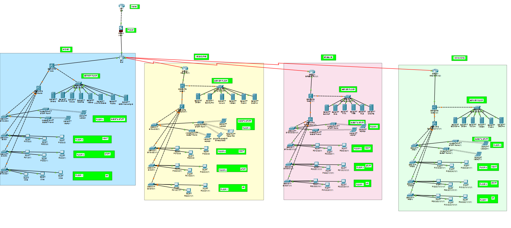
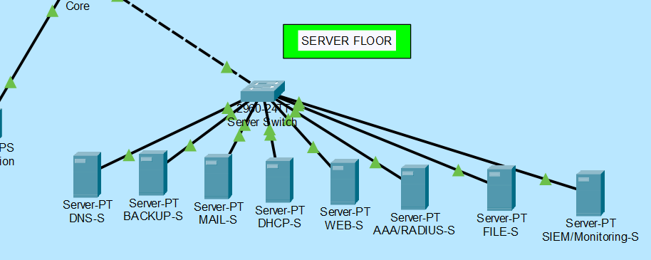
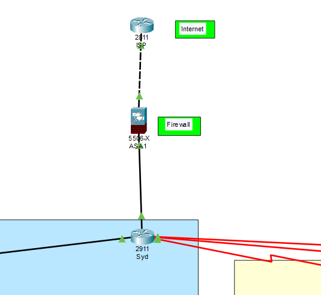
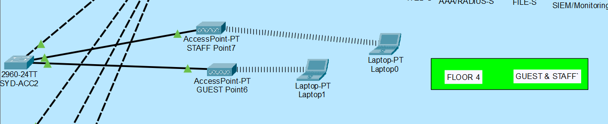
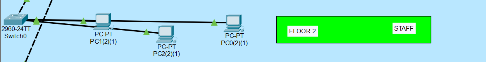
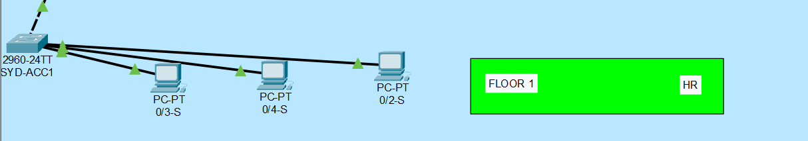
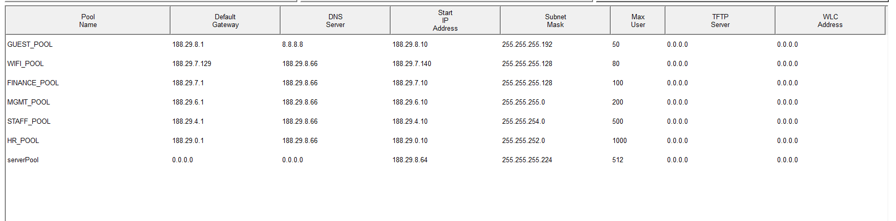
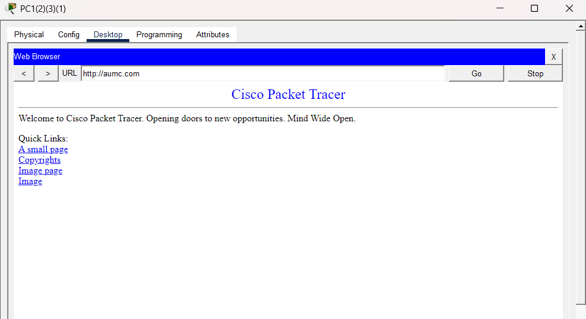
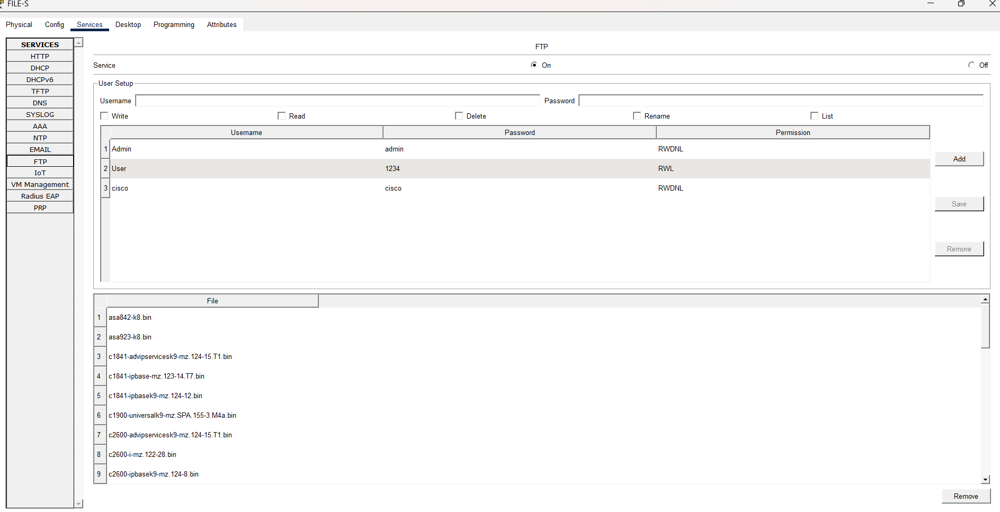
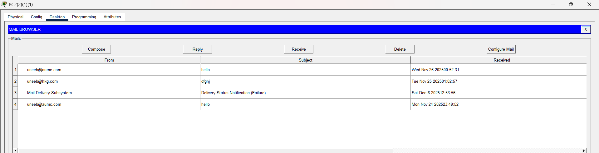

🌐 Enterprise Network Infrastructure (Cisco Packet Tracer)
📌 Project Overview

This project represents a multi-site enterprise network design implemented in Cisco Packet Tracer. The network simulates a real-world corporate environment with multiple international locations, department-wise VLAN segmentation, centralized services, and scalable IP addressing using DHCP.
It covers network planning, VLAN segmentation, routing, and core server services with a structured and scalable approach.

All diagrams are stored in the Screenshots/ folder and are displayed after their respective explanations.

🏗️ Overall Network Design

This diagram represents the high-level architecture of the network, showing how core devices, distribution layers, and access networks are interconnected to form a unified system.

🖥️ Server Infrastructure

This section explains the centralized server architecture, where essential services are hosted and securely connected to the core network.

🔀 Routing Configuration

This diagram illustrates how routing enables communication between different networks and VLANs, ensuring efficient and reliable data transfer.

📶 Wireless VLAN

The Wireless VLAN is designed to segregate wireless users, providing controlled access while maintaining network security and performance.

🛠️ Management VLAN

The Management VLAN is dedicated to network administration, allowing secure monitoring and configuration of network devices.

👨‍💼 Staff VLAN

This VLAN isolates staff users to ensure better access control, traffic management, and organizational security.

🧑‍💼 HR VLAN

The HR VLAN protects sensitive human resource data by separating HR traffic from other departments.

📡 DHCP Service

This section demonstrates how DHCP automatically assigns IP addresses to devices across different VLANs.

🌐 HTTP Service

This diagram shows the HTTP web service deployment, allowing users to access web resources within the network.

📁 FTP Service

The FTP service enables secure file transfer between servers and network clients.

✉️ Email Service

This diagram explains the email server configuration, supporting internal organizational communication.

## Key Features
- Enterprise Network Architecture  
- VLAN Segmentation (HR, Staff, Management, Wireless)  
- Routing & Inter-VLAN Communication  
- DHCP, HTTP, FTP, Email Services  
- Centralized Server Design  
